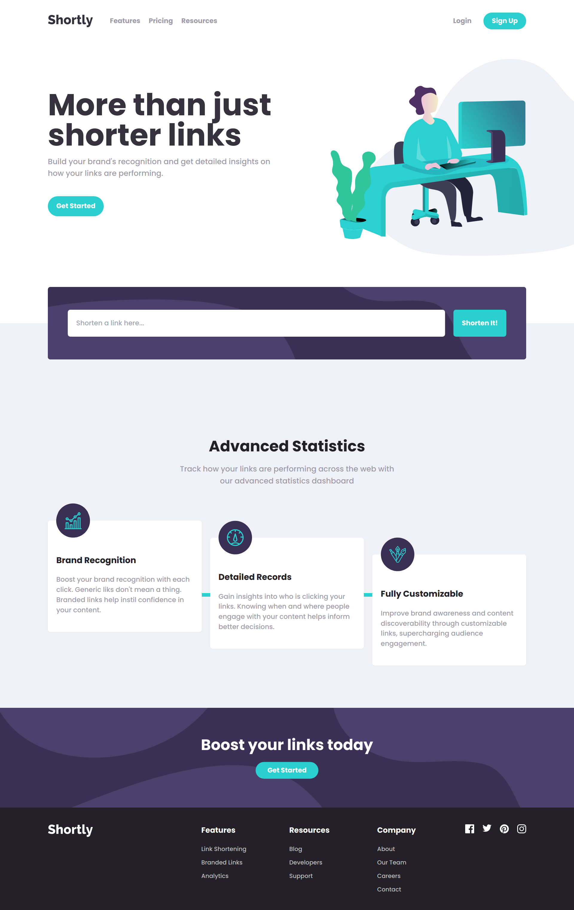
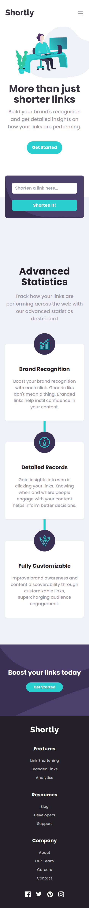

# Frontend Mentor - Shortly URL shortening API Challenge solution

This is a solution to the [Shortly URL shortening API Challenge challenge on Frontend Mentor](https://www.frontendmentor.io/challenges/url-shortening-api-landing-page-2ce3ob-G). Frontend Mentor challenges help you improve your coding skills by building realistic projects.

## Table of contents

- [Frontend Mentor - Shortly URL shortening API Challenge solution](#frontend-mentor---shortly-url-shortening-api-challenge-solution)
  - [Table of contents](#table-of-contents)
  - [Overview](#overview)
    - [The challenge](#the-challenge)
    - [Screenshot](#screenshot)
    - [Links](#links)
  - [My process](#my-process)
    - [Built with](#built-with)
    - [What I learned](#what-i-learned)
    - [Continued development](#continued-development)
    - [Useful resources](#useful-resources)
  - [Author](#author)

## Overview

### The challenge

Users should be able to:

- View the optimal layout for the site depending on their device's screen size
- Shorten any valid URL
- See a list of their shortened links, even after refreshing the browser
- Copy the shortened link to their clipboard in a single click
- Receive an error message when the `form` is submitted if:
  - The `input` field is empty

### Screenshot

### Links

<!-- - Solution URL: [Add solution URL here](https://your-solution-url.com) -->

- Live Site URL: [url-shortener](https://url-shortener-puce.vercel.app/)

## My process

### Built with

- Flexbox
- Mobile-first workflow
- [React](https://reactjs.org/) - A JavaScript library for building user interfaces
- [TailwindCSS](https://tailwindcss.com/) - utility class CSS Framework
- [axios](https://axios-http.com/) - promise-based http client library for javascript

### What I learned

In building this application, I learned a lot about styling web pages, especially in using css properties, namely translate and transform origin

### Continued development

For future development, I want to add a login feature and a feature to save the shortened URL for each user account. In addition, the addition of some pages is also needed to make this application more alive

### Useful resources

- [Stackoverflow](https://stackoverflow.com/questions/12150377/css3-transform-scale-stick-to-bottom) - This forum helped me in understanding how to make image scaling possible from the bottom as opposed to scale from the center of the image
- [TailwindCSS](https://tailwindcss.com/) - Obviously the most important thing in applying the styling of the framework on the website is to read directly on the documentation

## Author

- Github - [Yukiao](https://github.com/yukiao)
- Frontend Mentor - [@yukiao](https://www.frontendmentor.io/profile/yukiao)
- Instagram - [@1yukiao9](https://www.instagram.com/1yukiao9/)
